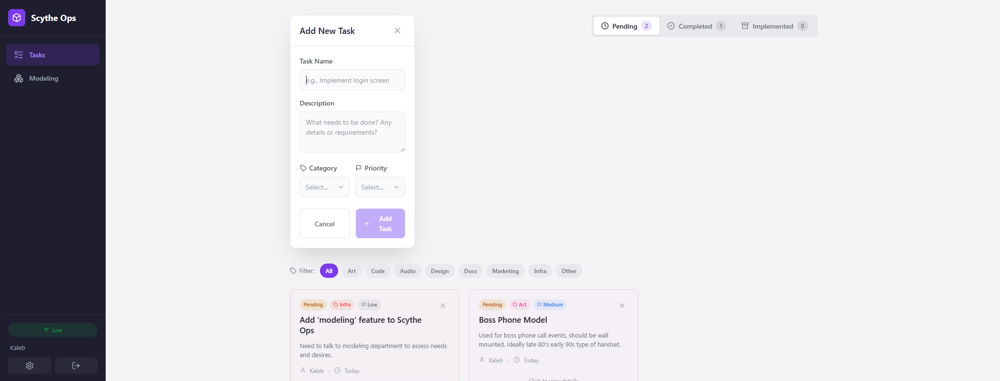

# Scythe Ops

Internal task tracking tool for the team. Keep track of what needs to be done, who's working on what, and what's been completed.

---

## Quick Start

1. Run `scytheops.exe`
2. Sign in with your team email
3. Start tracking tasks!

---

## How to Use

### Adding a Task

1. Click the purple **"Add New Task"** button
2. Fill in the task name
3. Add a description explaining what needs to be done
4. Choose a **Category** (Art, Code, Audio, Design, Docs, Marketing, Infra, Other)
5. Set the **Priority** (Low, Medium, High, Critical)
6. Click **"Add Task"**

### Viewing Tasks

- **Pending tab** - Tasks that still need to be done
- **Completed tab** - Tasks that are done but need review/verification
- **Implemented tab** - Archived tasks (auto-deleted after 7 days)
- **Filter buttons** - Click any category to filter the list

### Task Workflow

Tasks flow through three stages: **Pending → Completed → Implemented**

1. Click on a task card to open details
2. Use **"Mark Completed"** when work is done
3. Use **"Mark Implemented"** to archive (auto-deletes in 7 days)
4. Use **"Back to..."** buttons if you need to revert a task

### Deleting a Task

Click the **X** on any task card.

---

## Categories

| Category | Use For |
|----------|---------|
| Art | Sprites, models, textures, animations |
| Code | Features, bug fixes, refactors |
| Audio | Music, sound effects, voice |
| Design | UI/UX, game design docs |
| Docs | Documentation, guides |
| Marketing | Trailers, social media, press |
| Infra | Build systems, CI/CD, tools |
| Other | Everything else |

---

## Priority Levels

- **Low** - Nice to have, no rush
- **Medium** - Should get done soon
- **High** - Important, prioritize this
- **Critical** - Drop everything, fix now

---

## Tips

- Use clear, descriptive task names
- Add enough detail in descriptions so anyone can pick it up
- Set realistic priorities (not everything is critical!)
- Check the Implemented tab to see what's been done

---

## Troubleshooting

**Can't sign in?**
- Check your email/password
- Try creating a new account if you haven't already

**Tasks not showing up?**
- Check your internet connection
- Try refreshing (close and reopen the app)

**Something else broken?**
- Ping the team lead

---

## Changelog

### v0.1.4
- Subtle category color coding on task cards
- Renamed "Check In Asset" to "Add New Task"

### v0.1.3
- Three-stage task workflow: Pending → Completed → Implemented
- Tasks can be moved forward and backward between stages
- Implemented tasks auto-delete after 7 days

### v0.1.2
- Added left sidebar navigation with Tasks and Modeling tabs

### v0.1.1
- Disabled auto-update artifacts temporarily
- Silent error handling for update checks

### v0.1.0
- Added auto-update functionality
- Auto version bump on build
- Renamed binary to scytheops.exe
- Security improvements (removed hardcoded credentials)

### v0.0.1
- Initial release
- Task management with categories and priorities
- Real-time updates
- Admin panel for user management

---

## For Devs

Built with Tauri + React + TypeScript + Supabase.

See `CLAUDE.md` for technical details.
